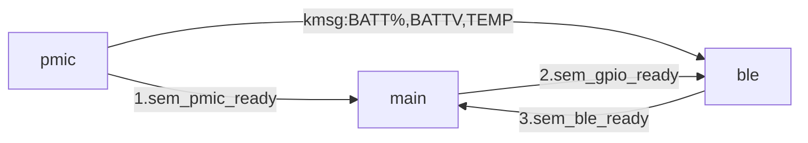

# seeed_npm2100_nrf54l15_BFG


<p align="center">
  <br>
  
  </br>
  This <b>unofficial</b> application demonstrates using an nRF54L15 as a Bluetooth Low Energy (BLE) peripheral,  powered by an nPM2100 power management IC (PMIC) and primary cell battery, as a wireless battery fuel gauge and PMIC controller. This is the sequel to the original <a href=github.com/droidecahedron/npm2100_nrf54l15_BFG>BFG Demo</a>).
  </br>
  However, you do NOT need so many kits and jumpers together as you did with this demo's predecessor! This time it's all together on one board.
</p>

# Requirements
## Hardware
- **nRF54L15 DK** to use as a programmer
  
  
  
- **Seeed nPM2100+nRF54L15 example design** (files can be found [here](https://nsscprodmedia.blob.core.windows.net/prod/software-and-other-downloads/reference-layouts/npm2100/qfn/2100_54l15_de.zip))
  
  

- **2x5 programming SWD ribbon cable** (example of one [here](https://www.digikey.com/en/products/detail/adafruit-industries-llc/1675/6827142?gclsrc=aw.ds&gad_source=1&gad_campaignid=20232005509&gclid=EAIaIQobChMIsqiQ1N-EkwMVHTWtBh1wpjdTEAQYASABEgLzsfD_BwE))
  
  

## Software
- [nRF Connect SDK](https://www.nordicsemi.com/Products/Development-software/nRF-Connect-SDK) `V3.1.2` to build and program.
- [nRF Connect for Mobile](https://www.nordicsemi.com/Products/Development-tools/nRF-Connect-for-mobile) for iOS/Android.


# Overview
The nRF54L15 is an ultra low power wireless SoC, and the nPM2100 is an efficient boost regulator for primary-cell batteries.
The nPM2100 also has two output regulators, a boost and LDO/load switch.

The Seeed studio board contains an nRF54L15 already connected with an nPM2100, conveniently packed with a SHPHLD button, LED, and IO keys along with an LR44 battery holder.  
When in ship mode, the device will be in a low power state. When outside of ship mode, it will advertise as a connectable BLE device, with characteristics for reporting battery level, battery voltage, and a command characteristic for powering down the device.

## Block Diagram
### Overall Application


### Fuel gauge block diagram


## BLE Characteristics (data/io)
Characteristic|UUID prefix|perm|Purpose|Data type
---|---|---|---|---
**Battery Level**|`2A19`|read|Standard GATT characteristic for reporting remaining battery percentage|byte
**2100 Read**|`0x21002EAD-0xA770`|read|Plaintext read of the battery voltage|UTF-8 string
**SHPHLD Write**|`0x57EED111-0x217E`|write|Lets you request for the device to go to sleep mode|bool


# Building and Running
This application is built like all other typical nRF Connect SDK applications.
To build the sample, follow the instructions in [Building an application](https://docs.nordicsemi.com/bundle/ncs-latest/page/nrf/app_dev/config_and_build/building.html#building) for your preferred building environment. See also [Programming an application](https://docs.nordicsemi.com/bundle/ncs-latest/page/nrf/app_dev/programming.html#programming) for programming steps.

`west build -b seeed_nrf54l15_npm2100/nrf54l15/cpuapp -p -- -DBOARD_ROOT="."` followed by `west flash`.

Then use the nRF Connect for Mobile app and use the scan filter for "Seeed" to find `Seeed npm2100_nrf54l15` (which is the name set in `prj.conf`), and play with the various characteristics using the table above.

> [!IMPORTANT]
> The Seeed board doesn't have an OBD like the nRF54L15-DK does. So use your nRF54L15-DK to program the Seeed board externally. The Seeed board needs to be powered, and match the pins. If your ribbon cable has a red line for P1, that can be matched by the dot on the silk as well as the orientation of "SWD" text on the Seeed board. See images below.


<br>

<br>

The LED will blink periodically while advertising, and when you connect via a central device (such as a smart phone) it will be on as a solid light.
You can press and hold SHPHLD for ~2 seconds to enter ship mode (and the LED will stay off), and press/hold it for about 500ms or half a second to exit shipmode (and the LED should blink again for BLE activity).

You can also write to the ship mode WR characteristic from a central device (like your phone) to enter ship mode via software, exiting it is still via the button.

## Example output
### nRF Connect for Mobile (iOS)


### Reading values


### Logs
> [!IMPORTANT]
> The UART is **not** connected. You will need to use RTT on your programmer for logs (either nRF54L-15DK or some other programming device) and enable `CONFIG_LOG=y` for logs. Serial communications (namely RX) are a drain on power in general (to the order of hundreds of microamps), so disable them in a contemporary use case if you do not need them.


#### Startup
```
*** Booting nRF Connect SDK v3.2.1-d8887f6f32df ***
*** Using Zephyr OS v4.2.99-ec78104f1569 ***
[00:00:00.020,444] <inf> ble: ble write thread: entered
[00:00:00.020,458] <inf> pmic: PMIC device ok
[00:00:00.021,070] <inf> ble: ble write thread: woken by main
[00:00:00.021,121] <inf> bt_sdc_hci_driver: SoftDevice Controller build revision: 
                                            9b 8f ac c3 1d 42 ae 44  fa cd 1f c3 48 a0 b4 2f |.....B.D ....H../
                                            cf 29 ee 3d                                      |.).=             
[00:00:00.022,214] <inf> bt_hci_core: HW Platform: Nordic Semiconductor (0x0002)
[00:00:00.022,225] <inf> bt_hci_core: HW Variant: nRF54Lx (0x0005)
[00:00:00.022,236] <inf> bt_hci_core: Firmware: Standard Bluetooth controller (0x00) Version 155.44175 Build 2923568579
[00:00:00.022,626] <inf> bt_hci_core: HCI transport: SDC
[00:00:00.022,692] <inf> bt_hci_core: Identity: E4:68:99:70:CA:CC (random)
[00:00:00.022,707] <inf> bt_hci_core: HCI: version 6.2 (0x10) revision 0x3020, manufacturer 0x0059
[00:00:00.022,722] <inf> bt_hci_core: LMP: version 6.2 (0x10) subver 0x3020
[00:00:00.022,725] <inf> ble: Bluetooth initialized
[00:00:00.023,159] <inf> ble: Advertising successfully started
[00:00:00.028,275] <inf> pmic: Fuel gauge initialised for LR44 battery.
[00:00:00.033,850] <inf> pmic: PMIC Thread sending: V: 1.538, T: 18.50, SoC: 85
[00:00:00.033,878] <inf> ble: BLE thread rx from PMIC: V: 1.54 T: 18.50 SoC: 85 
[00:00:00.033,881] <inf> ble: BLE Thread does not detect an active BLE connection
[00:00:01.039,552] <inf> pmic: PMIC Thread sending: V: 1.562, T: 18.50, SoC: 85
[00:00:01.134,134] <inf> ble: BLE thread rx from PMIC: V: 1.56 T: 18.50 SoC: 85 
[00:00:01.134,138] <inf> ble: BLE Thread does not detect an active BLE connection
```

#### Connected
```
[00:05:01.865,489] <inf> ble: Connected
[00:05:02.335,650] <wrn> bt_l2cap: Ignoring data for unknown channel ID 0x003a
[00:05:02.511,350] <inf> pmic: PMIC Thread sending: V: 1.538, T: 16.38, SoC: 85
[00:05:02.605,863] <inf> ble: BLE thread rx from PMIC: V: 1.54 T: 16.38 SoC: 85 
[00:05:02.605,962] <wrn> ble: Warning, notification not enabled for pmic stat characteristic <-- This goes away when you subscribe to that BATT V : #.##V characteristic
```

# Software Description
Standard BLE peripheral.
There are 3 primary modules. Below is a table of pertinent (not all) files in this project and their purpose.

File|purpose|
---|---
main.c|initial setup of the DK, relaying synchronization information between LE module and PMIC module.
pmic/pmic.c|performs initialization of the nPM2100, has a fuel gauging task that sends kernel messages to the BLE module with the results, as well as a task that is set up to handle received requests to enter ship mode.
ble/ble_periph_pmic.c|houses the bulk of the BLE application code, is the recipient of most of the messages from the other software modules, but waits to sync with the PMIC module on startup.
common/tsync.h|breaks out easy semaphore access between the modules.


The following flowchart shows the semaphore exchange order, as well as the kmsg directions from each module.

